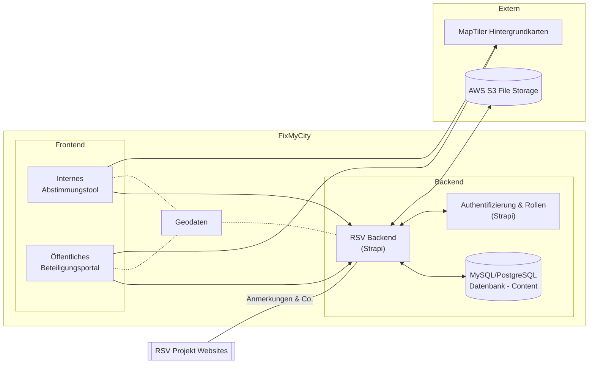
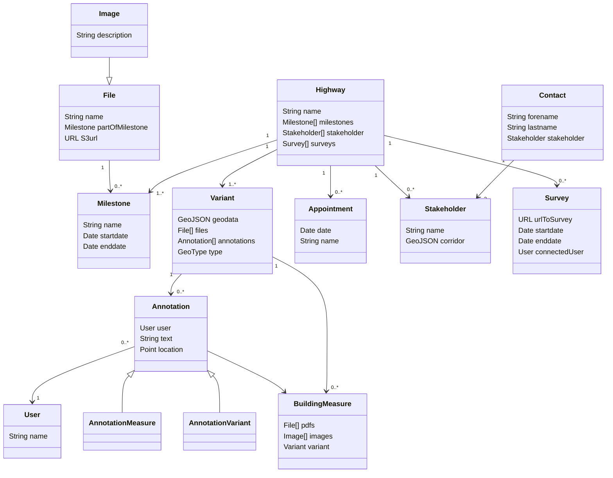

# Architecture

## Flow diagram
The planned structure of our future backend of RSV:

```mermaid
flowchart LR
    backend["RSV Backend\n(Strapi)"]
	S3[(AWS S3 File Storage)]
	MySql[(MySQL/PostgreSQL\nDatenbank - Content)]
	ToolIntern[Internes\nAbstimmungstool]
	ToolExtern[Öffentliches\nBeteiligungsportal]
	Auth["Authentifizierung & Rollen\n(Strapi)"]
	MapTiler[MapTiler Hintergrundkarten]
	Geodaten[Geodaten]
	ProjectWebsite[[RSV Projekt Websites]]
	subgraph FixMyCity
		subgraph Backend
		backend <--> MySql
		backend <--> Auth
		end
		subgraph Frontend
		ToolIntern --> backend
		ToolExtern --> backend
		end
		ToolIntern -.- Geodaten
		ToolExtern -.- Geodaten
		Geodaten -.- backend
	end
	subgraph Extern
	backend <--> S3
	ToolIntern --> MapTiler
	ToolExtern --> MapTiler
	end
	ProjectWebsite -- "Anmerkungen & Co."--- backend
```

## Class diagram

The planned classes are as the following:

```mermaid
classDiagram
	Highway "1" --> "1..*" Milestone
	Highway "1" --> "1..*" Variant
	Highway "1" --> "0..*" Appointment
	Variant "1" --> "0..*" Annotation
	Annotation "0..*" --> "1"  User
	Contact "1" --> "?" Stakeholder
	File "1" --> "0..*" Milestone
	Highway "1" --> "0..*" Survey
	Highway "1" --> "0..*" Stakeholder
	Variant "1" --> "0..*" BuildingMeasure
	Annotation <|-- AnnotationMeasure
	Annotation <|-- AnnotationVariant
	Annotation --> BuildingMeasure
	Image --|> File
    class Annotation {
		User user
		String text
		Point location
	}
	class AnnotationMeasure {

	}
	class AnnotationVariant {

	}
	class Variant {
		GeoJSON geodata
		File[] files
		Annotation[] annotations
		GeoType type
	}
	class BuildingMeasure {
		File[] pdfs
		Image[] images
		Variant variant
	}
	class Highway{
		String name
		Milestone[] milestones
		Stakeholder[] stakeholder
		Survey[] surveys
	}
	class Appointment {
		Date date
		String name
	}
	class Milestone {
		String name
		Date startdate
		Date enddate
	}
	class User {
		String name
	}
	class File {
		String name
		Milestone partOfMilestone
		URL S3url
	}
	class Stakeholder {
		String name
		GeoJSON corridor
	}
	class Contact {
		String forename
		String lastname
		Stakeholder stakeholder
	}
	class Survey {
		URL urlToSurvey
		Date startdate
		Date enddate
		User connectedUser
	}
	class Image {
		String description
	}
```
