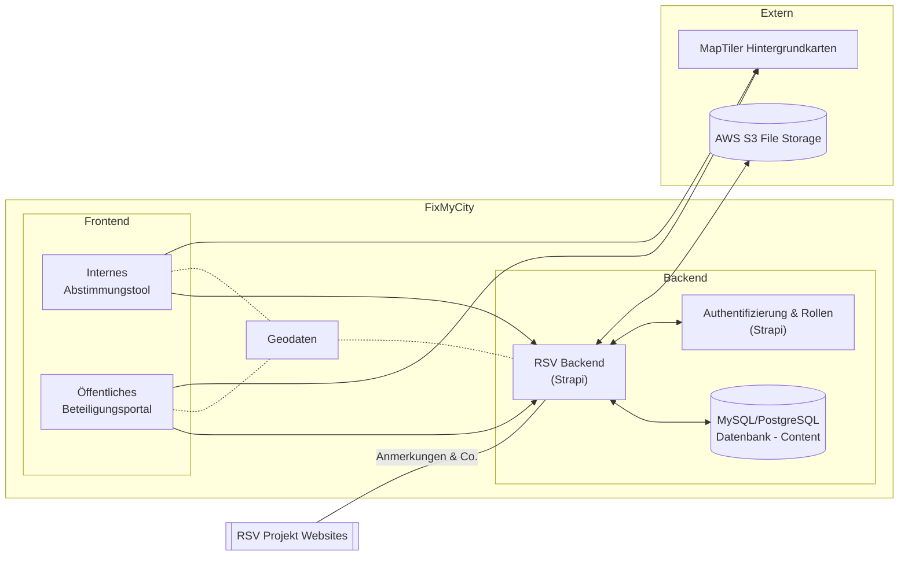

# Architecture

The planned structure of our future backend of RSV:

```mermaid
flowchart LR
    backend["RSV Backend\n(Strapi)"]
	S3[(AWS S3 File Storage)]
	MySql[(MySQL/PostgreSQL\nDatenbank - Content)]
	ToolIntern[Internes\nAbstimmungstool]
	ToolExtern[Öffentliches\nBeteiligungsportal]
	Auth["Authentifizierung & Rollen\n(Strapi)"]
	MapTiler[MapTiler Hintergrundkarten]
	Geodaten[Geodaten]
	ProjectWebsite[[RSV Projekt Websites]]
	subgraph FixMyCity
		subgraph Backend
		backend <--> MySql
		backend <--> Auth
		end
		subgraph Frontend
		ToolIntern --> backend
		ToolExtern --> backend
		end
		ToolIntern -.- Geodaten
		ToolExtern -.- Geodaten
		Geodaten -.- backend
	end
	subgraph Extern
	backend <--> S3
	ToolIntern --> MapTiler
	ToolExtern --> MapTiler
	end
	ProjectWebsite -- "Anmerkungen & Co."--- backend
```
