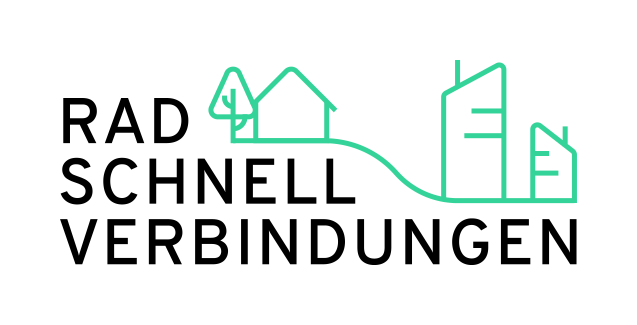

  
  <h1 align="center"><a href="https://radschnellverbindungen.info/">Radschnellverbindungen.info</a></h1>

This site show's general information about Radschnellverbindungen (cycle highways) in Germany and specific about specific highways which are planned or build.

## 💾 Data

TLDR: The (geo)data is available in the [`content/geometries/`](./src/radschnellwege) folder. If you use the data, attribute it like this:

> © [FixMyCity](https://fixmycity.de)/[RSV-Dossier](https://github.com/FixMyBerlin/rsv-dossier) - [ODbL License](https://opendatacommons.org/licenses/odbl/summary/index.html)

You find the geometry and meta information about the highways under [`./src/radschnellwege/`](./src/radschnellwege/). There is one file for all highways in [`meta/`](./src/radschnellwege/meta) folder containing the meta information. In the [`geometries/`](./src/content/geometries) folder, every cycle highway has one individual file. In [`./data/schema/`](./data/schema/)you'll find the schema for the json files.

See [**README.md**](./src/radschnellwege/README.md) for more details.

## 🧑‍💻 Developing

If you found any bugs feel free to create an issue.

### Getting Started

For starting developing, the following steps could be helpful for getting started:

- Use or nvm to install Node.js: `nvm use`
- Install dependenices: `npm install`
- Start astro develop service: `npm start`
- Use `npm run` to see a list of commands

We use husky to ensure commits don't include linting issues. If you use nvm, as suggested here, you should create a `~/.huskyrc`. See [docs](https://typicode.github.io/husky/#/?id=command-not-found)

Setup your `.env.development` file, for which you can use `.env.defaults` as a start.

For production you will also need a `.env.production` file. Otherwise the modules using the env variables, will not work.

## Keystatic and Blog

We use [Keystatic](https://keystatic.com/docs/introduction) for the blog on /planung and /kommunikation.

CMS Admin UI: [http://127.0.0.1:4321/keystatic](http://127.0.0.1:4321/keystatic)
Homepage: [http://localhost:4321](http://localhost:4321)

## License

This project has different licenses. The code is licensed under the AGPL-3.0 License - see the [LICENSE.md](LICENSE.md) file for more information.
It contains dependencies which have different Licenses, see [`package.json`](./package.json).

For the license of the data, please see the specific [README.md](./src/radschnellwege/README.md) respectively [LICENSE](./src/radschnellwege/LICENSE) file.
