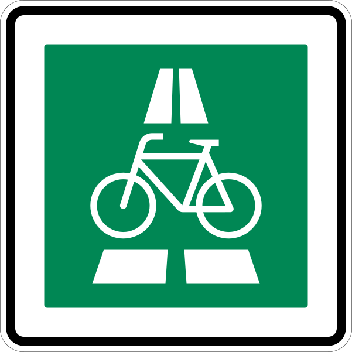

<div align="center">
    
    <h1>Radschnellwege Deutschland</h1>
</div>

> This project is in progress. Accuracy of ways are getting improved as time flows and the Radschnellwege have finished planning.

> There are still Radschnellwege and attributes of them missing. Open a pull-request, an issue or contact me when you want to improve something.

A list, map, database (call it how you like) of planned, currently build and finished cycle highways (Radschnellwege) in Germany. All handmade and updated manually.

The format is a [GeoJSON](https://geojson.org/) file. Just open it in your favorite GeoJSON viewer. The GeoJSON consists of `LineString` and `MultiLineString`, when there are ways which splits (Y-ways).

Contains map data from OpenStreetMap, which has the attribute `copyright="OpenStreetMap"`; © OpenStreetMap contributors. Therefore [LICENSE](LICENSE) does only apply on data which has no copyright attribute.

## Meta Data

Every cycle highway has it's own meta information, independent from the individuals geometry segments and variants. These information apply to the cycle highway as a whole. The `meta.json` file is an array of multiple cycle highways.

> You can use the [JSON Schema for MetaJSON](schema/meta.schema.json) for validation and generation of TypeScript types.

### Types generation

You can use the [json-schema-to-typescript](https://www.npmjs.com/package/json-schema-to-typescript) to generate TypeScript types out of the JSON Schema. For that, install the package : `npm install -g json-schema-to-typescript`

Then run:
```sh
npx json2ts -i schema/meta.schema.json -o ../types/meta.d.ts
```

For a human readable documentation, you can generate a HTML file using [json-schema-for-humans](https://pypi.org/project/json-schema-for-humans/).

Install first: ```pip install json-schema-for-humans```
Then run
```sh
generate-schema-doc schema/meta.schema.json schema/
```

### State
A cycle highway MUST have one of the following states, segments CAN have one of the following state:

1. `idea` - Politically discussed and not agreed, planning has not started
2. `agreement_process` - It is in political discussion if planning of the cycle highway will be executed. The pilot study is finished, but planning has not been started
3. `planning` - the highway is in one of the planning phases, except `pilot_study`
4. `in_progress` - The segments have different planning phases, but as a whole it marches on
5. `done` - The cycle highway part is built, finished and ready for usage
* `discarded` - While planning it does not meet the requirements or it is not desired anymore

### Stakeholders & Roles

Every organization / institution CAN be part of the `stakeholders` attribute. Every stakeholder MUST have an role. Since `stakeholders` and `roles` are an array there can be multiple stakeholder holding the same role. Stakeholders are also available in *Detail segments*.

**Example:**
```jsonc
"stakeholders": [
    {
        "name": "Regionalverband Ruhr",
        "roles": ["communication"],
        "description": "RVR Ruhr ist zuständig für die Kommunikationsstrategie & -durchführung",
    },
]
```

Available roles are: `"communication"`, `"authority"` and `"construction_company"`

### Example Meta JSON

The data model is the following [`JSON Schema`](), with allowed/example values.

```jsonc
"meta": {
    "id": "rs1_nrw",
    "general": {
        "ref": "RS1", // official abbreviation
        "name": "Radschnellweg Ruhr RS1",
        "from": "Duisburg, Nordrhein-Westfalen", // State MUST be separated after place name
        "to": "Hamm, Nordrhein-Westfalen",
        "description": "Der RS1 führt auf über 100km von Duisburg nach Hamm unteranderem über Mülheim, Essen, Gelsenkirchen und Dortmund hindurch. Es wurden bereits über 15km fertiggestellt.",
        "slug": "rs1-radschnellweg-ruhr" // manual slug for URLs (no whitespace allowed)
    },
    "stakeholders": [
        {
            "name": "Straßen.NRW",
            "roles": ["authority"],
            "description": "",
        },
        {
            "name": "Regionalverband Ruhr",
            "roles": ["communication"],
            "description": "RVR Ruhr ist zuständig für die Kommunikationsstrategie & -durchführung",
        },
    ],
    "state": "planning",
    "planning_phase": "design",
    "detail_level": "exact",
    "finished": "2024", // [optional] Year (and month) of finishing or expected finishing (format: "YYYY-MM" or "YYYY")
    "cost": 43000, // [optional] All costs summarized, in thousand Euro (€)
    "references": {
        "osm_relation": "5697663", // [optional] Referencing to the complete route, usually after at least one part has been built
        "website": "http://rs1.ruhr",
        "copyright:geometry": "OpenStreetMap", // [optional] If map data from other source
    }
}
```

The **`detail_level`** describes in which accuracy the geometry is available in the GeoJSON. It MUST be one of the values: `exact`, `approximated`, `corridor`. The `rough` value is an alias of `approximated`.

## Geometry Data
Corresponding to the Meta JSON file, the *GeoJSON* file contains the geometry of the cycle highways. There are two types of cycle highway geometry types:

* Variants (usually between `pilot` and `design` phases)
* Segments (usually starting from `design` phase)

**Variants** are possible relations between places (cities and villages), which exact pathway has not been defined and planned (yet). They occur mostly in the `preliminary` phase.

**Segments** are parts of the planned pathway of a complete cycle highway. Sometimes there alternative ways beside the primary pathway. This version of the pathway mostly occurs in the `design` phase. Segments are about to be build, are being built or already done.

The both geometry types reside both in the same GeoJSON file. If the planned cycle highway is available through the sections, the variants SHOULD NOT be removed. A frontend can than decide if which data should be displayed. Segments and Variants don't share any geometry.

### Segment

A segment is a part of a planned cycle highway. It has attributes describing the condition and information about the cycleway segment. Multiple segments are the planned cycle highway. Every segment has a planning phase. Variants **do not** have planning phases.

#### Segment attributes

An example for **segment attributes**:
```jsonc
{
    "id": "rs1_seg598",
    "status": "planning",
    "planning_phase": "design",
    "description:planning_phase": "",
    "detail_level": "exact",
    "stakeholders": [
        {
            "name": "Stadt Duisburg",
            "roles": ["authority"],
            "description": "Baulastträger",
        }
    ],
    "length": 12100 // implicit, MUST be calculated from geometry
}
```

The attribute `segment` would be the properties of the segment in a GeoJSON.

The **filename** MUST correspond to the `general.id` in the MetaJSON. Therefore a direct relation between geometry and meta information is possible. It could be like `frm1_hessen.geojson`.

### Planning Phases

Since this repository should represent build phases of the cycle highways, these are the planning phases used exclusively in this order:
1. Pilot study [`pilot`]
2. Preliminary planning [`preliminary`]
3. Design planning [`design`]
4. Approval procedure [`approval`]
5. Execution planning [`execution`]
6. Building [`building`]

Planning phases are assigned through attribute `planning_phase`. The attribute is empty, when the cycle highway is finished. For example a cycle highway in *approval procedure* SHOULD be assigned in the segments like this:

```jsonc
{
    // ..
    "state": "planning",
    "planning_phase": "approval",
    "description:planning_phase": ""
}
```

If needed, the planning phase can be further described with the attribute `description:planning_phase`. It MUST contain a `string`, which is usually a text, describing any details.

When the whole cycle highway get's discarded, the planning phase it stuck and SHOULD still be part of the cycle highway.

### Variants
Usually in the early planning phases there are multiple possible variants of the cycle highway. Every variant includes the complete route from start to end. It additionally has the following `variant` attribute.

```json
{
    "variant": "Trassenvariante 2",
    "discarded": false
}
```

The **`variant`** describes the official name. The preferred variant is usually called "Vorzugstrasse".

The **filename** MUST correspond to the `general.id` in the MetaJSON. Therefore a direct relation between geometry and meta information is possible. It could be like `frm1_hessen.geojson`.

The **`discarded`** property describes that a variant was a considered variant previously, but is discarded now. The geometry therefore stays in the GeoJSON. In constrast to the `discarded` key in the MetaJSON, this value only represents the state of one individual variant. Usually from time to time more and more variants get discarded till one preferred is found.

## See more

- [Explanation of Radschnellweg](https://de.wikipedia.org/wiki/Radschnellweg) in German Wikipedia
- [List of Radschnellwege](https://de.wikipedia.org/wiki/Liste_der_Radschnellverbindungen_in_Deutschland) in German Wikipedia
- [Explanation of Cycle Highways](https://cyclehighways.eu/about/what-is-a-cycle-highway.html) in CHIPS EU Project
- [Map of this data: `radschnellwege.chilla.dev`](https://radschnellwege.chilla.dev)
